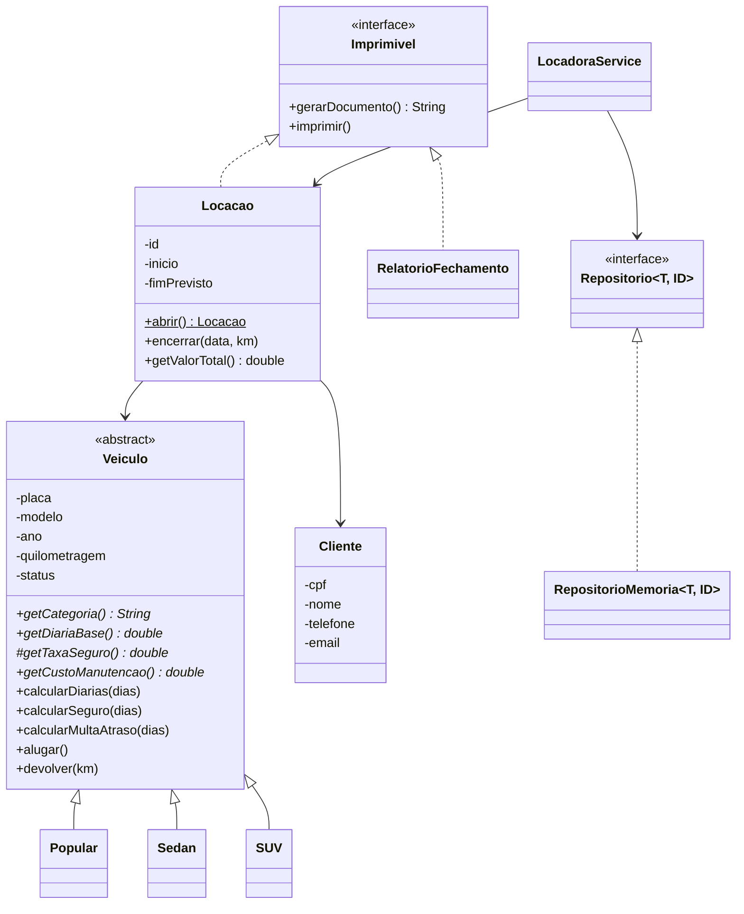

# Rota Segura - Sistema de Locação de Veículos (TP1)

**Aluno:** [SAMUEL GUANDALINI IGNACIO]
**Matrícula:** [1301392611011]

Aplicação de console em Java 17+ que gerencia frota, clientes e contratos de uma locadora, com persistência em arquivos de texto.

## 1. Arquitetura

```
src/rotasegura/
├── Main.java                 menu de console (trata todas as exceções)
├── Demonstracao.java         roteiro automático para a apresentação
├── modelo/                   Veiculo (abstrata), Popular, Sedan, SUV, Cliente, Locacao, StatusVeiculo
├── excecoes/                 RotaSeguraException (base) + 5 exceções específicas
├── relatorio/                Imprimivel (interface), RelatorioFechamento
├── repositorio/              Repositorio<T,ID>, RepositorioMemoria<T,ID>, Persistencia (genéricos)
├── servico/                  LocadoraService (regras de negócio + persistência)
└── util/                     Validacao (CPF, placa, e-mail, telefone, texto)
```

### Diagrama de classes (simplificado)



### Onde cada conceito foi aplicado (roteiro para a defesa)

| Conceito | Onde | O que mostrar |
|---|---|---|
| **Encapsulamento** | `Veiculo`, `Cliente`, `Locacao` | Atributos `private`; setters (`setAno`, `setNome`, `setEmail`...) validam via `Validacao`; mudanças de estado só por `alugar()`, `devolver()`, `encerrar()`; `RepositorioMemoria.listar()` devolve cópia imutável |
| **Herança e abstração** | `Veiculo` (abstrata) -> `Popular`, `Sedan`, `SUV` | Métodos abstratos `getDiariaBase()`, `getTaxaSeguro()`, `getCustoManutencao()` |
| **Polimorfismo** | `Veiculo.calcularDiarias/Seguro`, `Imprimivel` | Mesmo código calcula valores diferentes por categoria; `Locacao` e `RelatorioFechamento` são impressos pela mesma interface `Imprimivel` |
| **Generics** | `repositorio/` e `Persistencia` | `Repositorio<Veiculo,String>`, `Repositorio<Cliente,String>`, `Repositorio<Locacao,Integer>`; `Persistencia.gravar/ler` genéricos; `Conversor<T>` |
| **Exceções e resiliência** | `excecoes/`, `Main` | Exceções checadas por tipo de erro; `Main` captura e exibe mensagens sem encerrar o programa |
| **Persistência** | `LocadoraService.persistir/carregar` | Arquivos em `dados/` (veiculos.txt, clientes.txt, locacoes.txt), gravados a cada operação e recarregados na inicialização |

### Tabela de preços (definida por cada subclasse)

| Categoria | Diária | Seguro (% da diária/dia) | Manutenção |
|---|---|---|---|
| Popular | R$ 90 | 5% | R$ 250 |
| Sedan | R$ 150 | 8% | R$ 400 |
| SUV | R$ 220 | 12% | R$ 650 |

Regras do contrato: valor = diárias + seguro (pelos dias previstos) + multa de atraso (150% da diária por dia de atraso, calculada na devolução).

## 2. Como compilar e executar

Requisito: JDK 17 ou superior.

```bash
# na raiz do repositório
mkdir out
javac -encoding UTF-8 -d out $(find src -name "*.java")     # Linux/macOS
java -cp out rotasegura.Main
```

No Windows (PowerShell):

```powershell
mkdir out
javac -encoding UTF-8 -d out (Get-ChildItem -Recurse src -Filter *.java).FullName
java -Dfile.encoding=UTF-8 -Dstdout.encoding=UTF-8 -cp out rotasegura.Main
```

Os dados são gravados na pasta `dados/` (criada automaticamente). Para começar do zero, apague essa pasta.
A opção **10** do menu executa a demonstração automática (sem gravar em disco).

## 3. Cenários de teste realizados

| # | Cenário | Resultado esperado |
|---|---|---|
| 1 | Cadastrar veículos Popular, Sedan e SUV e listar | Listados com diária da categoria |
| 2 | Cadastrar cliente com CPF válido | Cliente cadastrado |
| 3 | Abrir locação de 3 dias (Sedan) | Contrato: diárias R$ 450,00 + seguro R$ 36,00 = R$ 486,00 |
| 4 | Devolver com 2 dias de atraso | Multa R$ 450,00; total R$ 936,00; veículo volta a DISPONIVEL |
| 5 | Relatório de fechamento | Faturamento por categoria e situação da frota |
| 6 | Alugar veículo já ALUGADO | `VeiculoIndisponivelException` |
| 7 | Alugar veículo em MANUTENCAO | `VeiculoIndisponivelException` |
| 8 | Data final anterior à inicial | `PeriodoInvalidoException` |
| 9 | Data de início no passado | `PeriodoInvalidoException` |
| 10 | Data inexistente (ex.: 31/02/2026) | Erro de data tratado no `Main`, sem fechar o programa |
| 11 | CPF inválido (ex.: 111.111.111-11) | `DadosInvalidosException` |
| 12 | Placa inválida ou categoria inexistente | `DadosInvalidosException` |
| 13 | Cliente ou veículo inexistente | `EntidadeNaoEncontradaException` |
| 14 | Devolver contrato já encerrado | `DadosInvalidosException` |
| 15 | Km de chegada menor que o de saída | `DadosInvalidosException` |
| 16 | Fechar e reabrir o programa | Veículos, clientes e contratos recarregados de `dados/` |

## 4. Roteiro sugerido para a apresentação (5 a 10 min)

1. Menu 1 -> 3 -> 2 -> 5 -> 6 -> 8: fluxo completo com comprovante.
2. Menu 5 com veículo ocupado e com datas inválidas (ou menu 10 para rodar todos os erros de uma vez).
3. Mostrar no código os pontos da tabela "Onde cada conceito foi aplicado".
